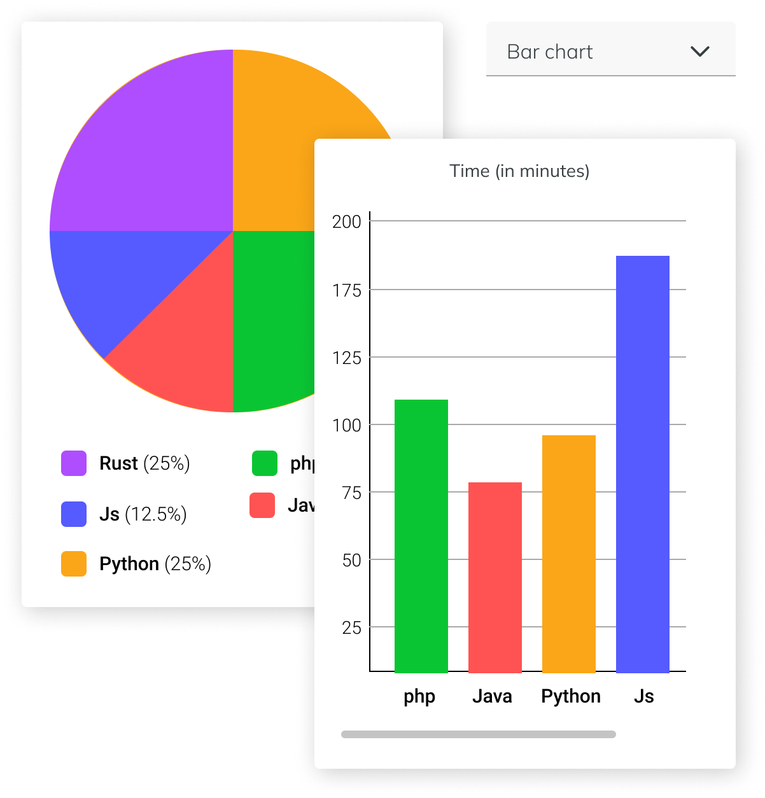

# Get Hired Code Tracker

> Measure your time spent programming and enhance your skills overtime

<a href="https://get-hired-code-tracker.vercel.app/">
  <image src="https://get-hired-code-tracker.vercel.app/_next/image?url=%2F_next%2Fstatic%2Fmedia%2Flogo-app.4541bda0.png&w=256&q=70" />
</a>
  

[Get Hired Code Tracker](https://get-hired-code-tracker.vercel.app/) is an open source VS Code plugin for metrics, insights, and time tracking automatically generated from your programming activity. This plugin forms part of [Platzi Master Cohort 8](https://github.com/Platzi-Master-C8) efforts to provide proffesional education to LATAM

---

## Installation

1. Press `Ctrl + Shift + P` or `⌘ + Shift + P` and type `install`. Pick `Extensions: Install Extension`.

    
2. Type `GetHiredCodeTracker` and hit `enter`.

3. Restart Visual Studio Code.

4. Enter your token, then press `enter`.

    > (If you’re not prompted, press `Ctrl + Shift + P` or `⌘ + Shift + P` then type `Enter Token Hard`.)

5. Use VSCode and your coding activity will be displayed on your [Get Hired Code Tracker dashboard](https://get-hired-code-tracker.vercel.app/)

---

## Usage

Visit [get-hired-code-tracker.vercel.app](https://get-hired-code-tracker.vercel.app/) to see your coding activity.

